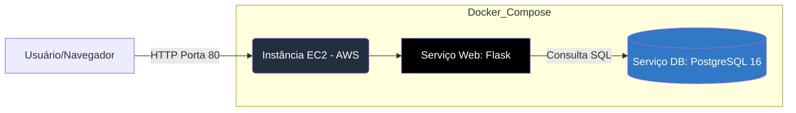

<div align="center">

  <h1>🎒 EducaSolidario - Cloud Edition</h1>

  <p>
    <strong>Infraestrutura Ágil para Gestão de Doações Escolares 🚀</strong>
  </p>

  <p>
    <a href="https://flask.palletsprojects.com/" target="blank"></a>
    <a href="https://aws.amazon.com/" target="blank"></a>
    <a href="https://www.postgresql.org/" target="blank"></a>
    <a href="https://www.docker.com/" target="blank"></a>
  </p>

</div>

<br />

O **EducaSolidario** é um projeto desenvolvido para a disciplina de Computação em Nuvem (IFCE). Esta versão foca na implantação de uma infraestrutura escalável utilizando **Docker Compose** em uma instância **IaaS (AWS EC2)**.

## 🏗️ Arquitetura da Solução



## 🚀 Objetivo
Demonstrar a execução de uma aplicação Web (Flask) integrada a um banco de dados (PostgreSQL), ambos orquestrados via Docker, rodando em uma máquina virtual na nuvem com acesso via IP público.

## 🛠️ Tecnologias Utilizadas
* **Linguagem:** Python 3.9 (Flask)
* **Banco de Dados:** PostgreSQL 16
* **Orquestração:** Docker Compose
* **Infraestrutura:** AWS EC2 (ou Oracle Cloud)
* **Sistema Operacional:** Linux (Ubuntu/Amazon Linux)

## 📁 Estrutura do Repositório
```
/
├── app/
│   ├── app.py          # Lógica da aplicação Flask e conexão DB
│   ├── requirements.txt # Dependências (flask, psycopg2-binary)
│   └── Dockerfile      # Build da imagem da aplicação
├── db/
│   └── init.sql        # Script de criação de tabela e carga inicial
└── docker-compose.yml  # Orquestração dos serviços
```

## ⚙️ Como Executar (Na Instância Cloud)
Pré-requisitos 📋
* Instância EC2 rodando (Ubuntu recomendado).

* Docker e Docker Compose instalados na instância.

## Passo a Passo 🚀
Acesse sua instância via SSH:
```
ssh -i "sua-chave.pem" ubuntu@ip-publico-aws
```
Clone este repositório:
```
git clone [https://github.com/seu-usuario/educasolidario-cloud.git](https://github.com/seu-usuario/educasolidario-cloud.git)
cd educasolidario-cloud
```
Suba os serviços:
```
sudo docker compose up -d
```

Acesse no Navegador:

Abra ```http://seu-ip-publico-aws```

## 👥 Equipe (PI - UFCA)
* Juliett Figueirêdo (Desenvolvedor Cloud)
* Juan Carlos (Desenvolvedor Backend)
* Linderval Matias (Integrador & Editor)

📜 Licença
Este projeto foi desenvolvido para fins acadêmicos no curso de ADS - UFCA.
